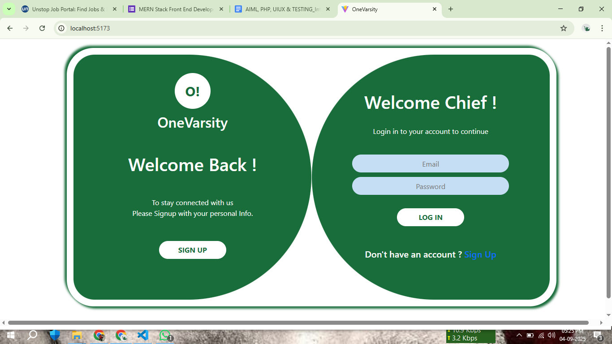
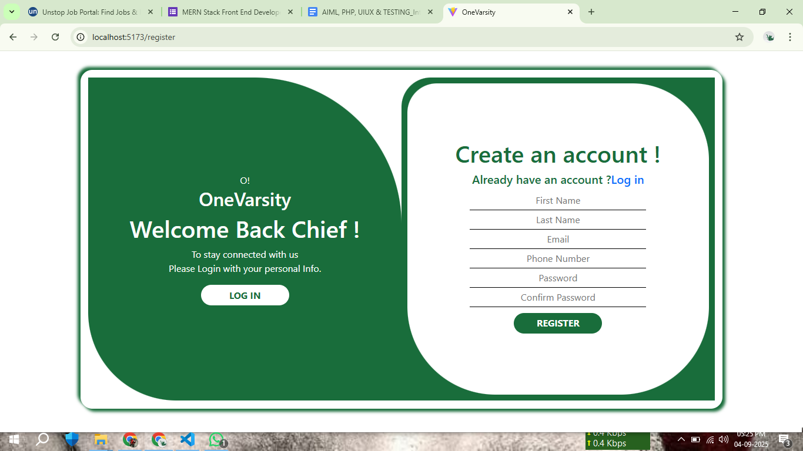
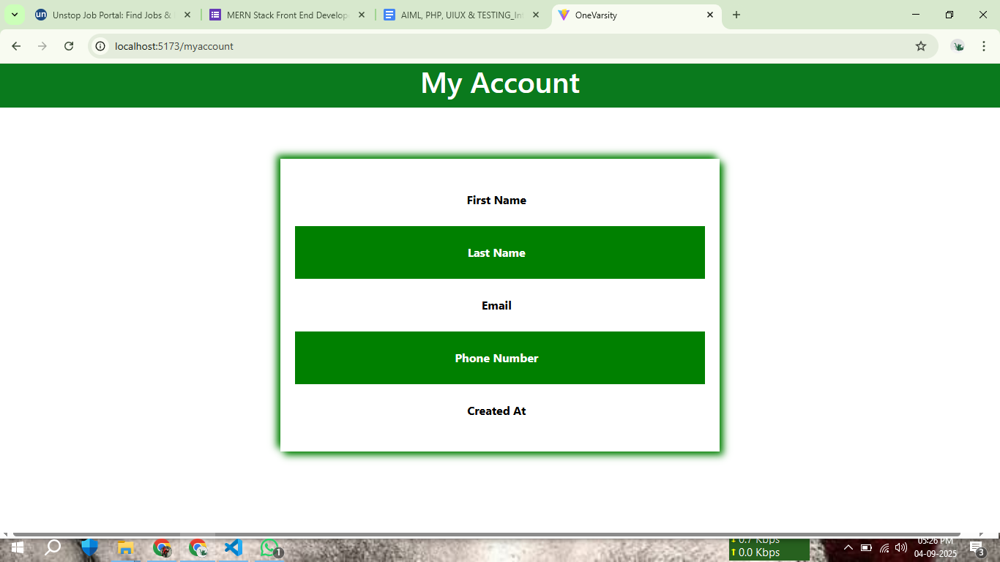
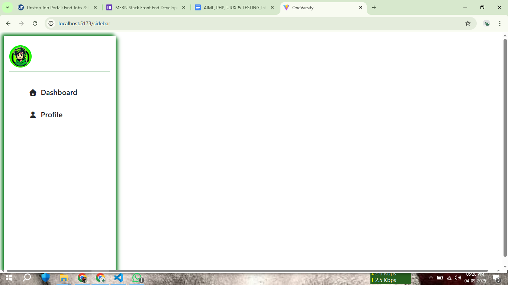
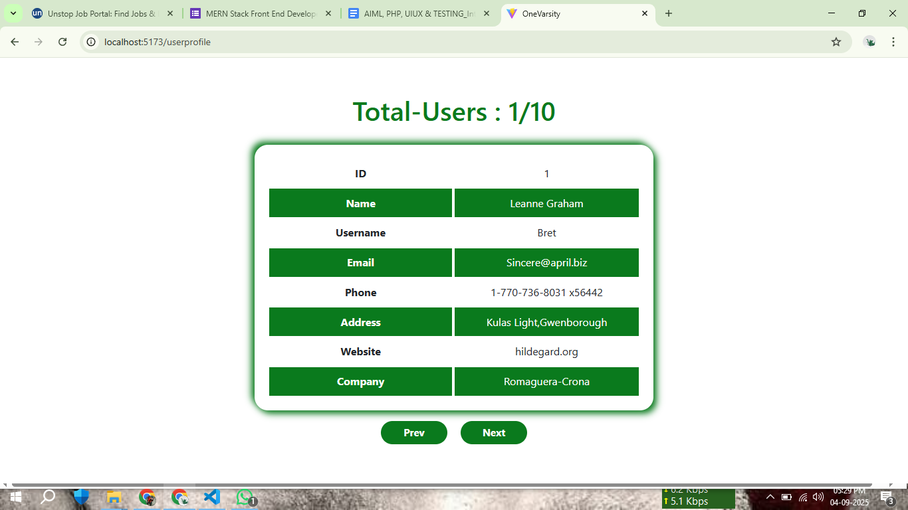
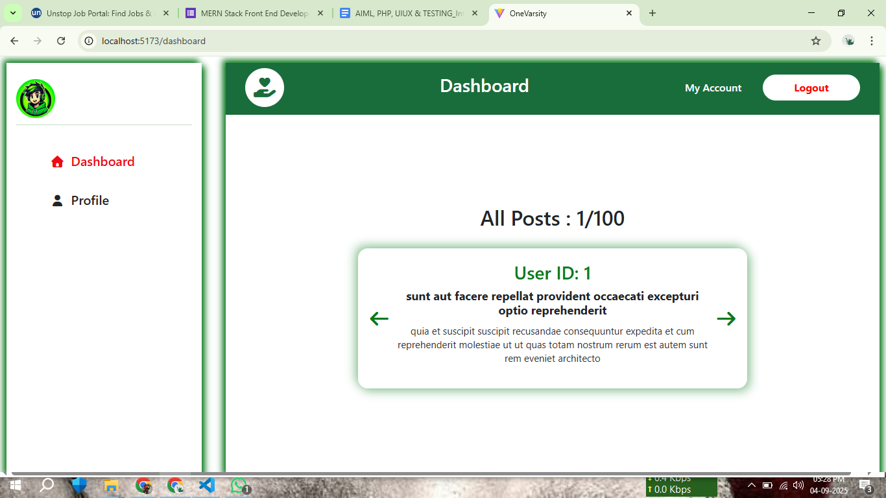

# Assignment-1: User Dashboard React Project (Vite)

# Project Overview

This project is a React application built using **Vite**. It includes a login/sign-in system, a user dashboard, user profile page, and integration with the JSONPlaceholder API to fetch users and posts. The application also **stores some user data in local storage** for persistence.

## Features

- Login / Sign In Page
- Dashboard Page
- User Profile Page
- Fetch users and posts from JSONPlaceholder API
- Display fetched data in a structured format
- Store and retrieve user data in **local storage**

## Project Setup Instructions

1. Clone the repository:
   git clone <repository-url>

2. Navigate to the project folder:
   cd assignment-1

3. Install dependencies:
   npm install

4. Start the Vite development server:
   npm run dev

5. Open your browser and go to the URL shown in the terminal (usually `http://localhost:5173`) to view the application.

## Dependencies Used

- **React**: Frontend framework for building UI.
- **React Router DOM**: For routing between pages (Login, Dashboard, Profile).
- **Fetch API**: To make API calls to JSONPlaceholder.
- **CSS** : For styling and layout.
- **Vite**: Fast development build tool.

## Folder Structure

assignment-1/
│
├── public/            # Public assets
├── src/               # Source files
│   ├── components/    # Reusable components
│   ├── styles/        # Styles
│   ├── App.jsx        # Main App component with routing
│   └── main.jsx       # Entry point
├── package.json       # Project dependencies
└── README.md          # Project documentation

## Usage

- Navigate to the Login page and sign in. Login credentials are saved in **local storage** to keep users logged in.
- After login, access the Dashboard to see user statistics.
- Visit the User Profile page to view user details fetch from JSON Placeholder API.
- The application fetches users and posts from JSONPlaceholder and displays them in the Dashboard and Profile page.
- All user-specific data can be stored and retrieved from **local storage** for persistence across sessions.

## Notes

- Make sure you have Node.js and npm installed.
- The project is built using **React 18+ with Vite**.
- API endpoints used: `https://jsonplaceholder.typicode.com/users` and `https://jsonplaceholder.typicode.com/posts`.
- Local storage is used to persist user login status and profile data.

## Github Link

Github : `https://github.com/26Jayasimman/Jayasimman`

## Deployed Links

Assesment-1 Deployed Link (Vercel) : `https://onevarsity-assignment-1.vercel.app/`

Assesment-2 Deployed Link (Vercel) : `https://onevarsity-assignment-2.vercel.app/`

## ScreenShots of UI

### Login Page

### Signup Page

### My Account Page

### Sidebar Page

### User Profile Page

### Dashboard Page

